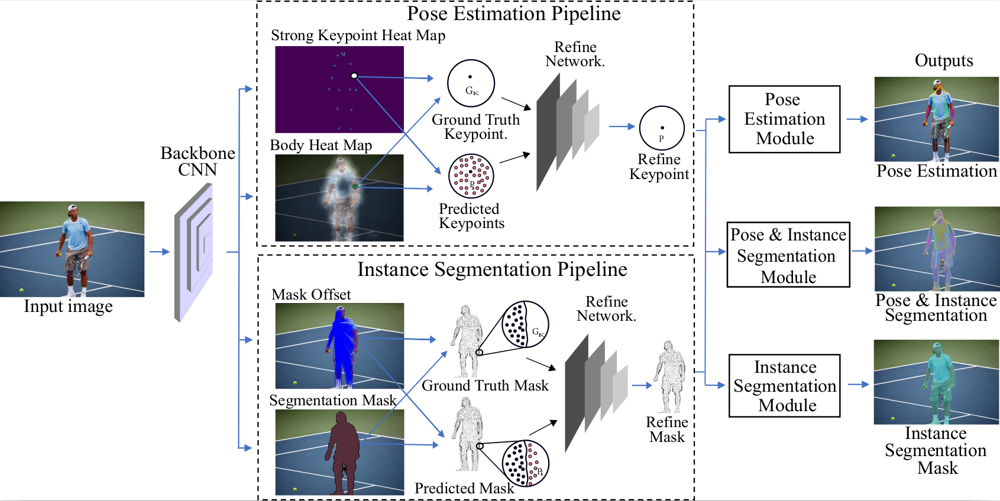

# PosePlusSeg (AAAI 2022)

Official code for the paper "Joint Human Pose Estimation and Instance Segmentation with PosePlusSeg"[arXiv] version will be available soon.

# Model Architecture 


# Setup environment

```
- python ==3.6
- conda install -c conda-forge matplotlib==2.0.2
- conda install -c conda-forge opencv OR pip install opencv-python
- conda install -c conda-forge pycocotools
- conda install -c anaconda scikit-image
- conda install tensorflow-gpu==1.13.1
```
# Download data

### COCO 2017

- [COCO 2017 Train images 118K/18GB](http://images.cocodataset.org/zips/train2017.zip)
- [COCO 2017 Val images 5K/1GB](http://images.cocodataset.org/zips/val2017.zip)
- [COCOPersons Train Annotation (person_keypoints_train2017_pose2seg.json) [166MB]](https://github.com/liruilong940607/Pose2Seg/releases/download/data/person_keypoints_train2017_pose2seg.json)
- [COCOPersons Val Annotation (person_keypoints_val2017_pose2seg.json) [7MB]](https://github.com/liruilong940607/Pose2Seg/releases/download/data/person_keypoints_val2017_pose2seg.json)

### Hint 

Person keypoint dataset is a subset of COCO2017 dataset ([COCO 2017 Train images 118K/18GB](http://images.cocodataset.org/annotations/annotations_trainval2017.zip)). We train our model only on human instaces keypoints and segmentation by intruducing a multi task system. 
